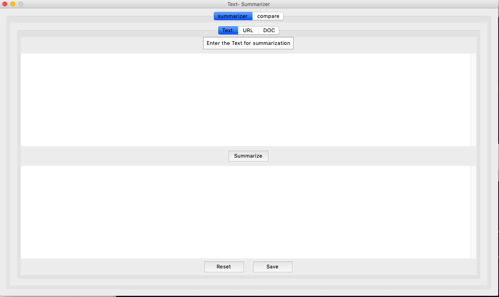
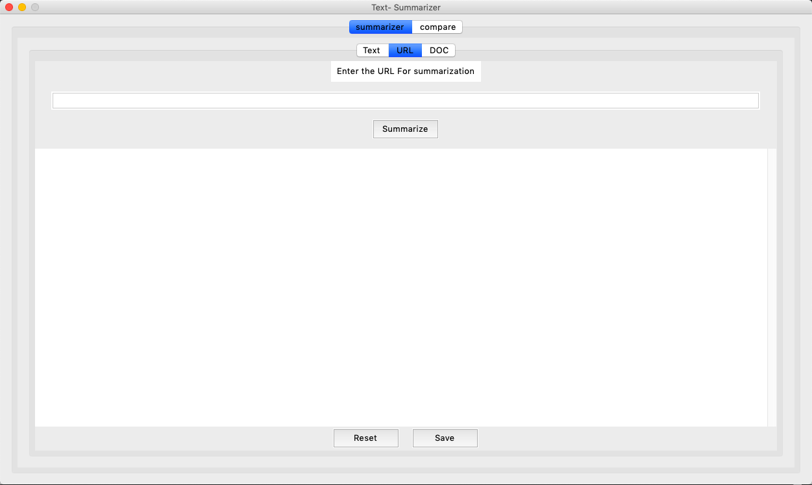
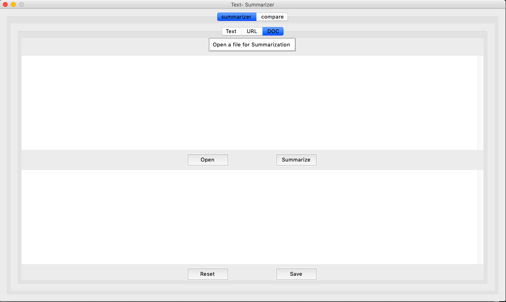
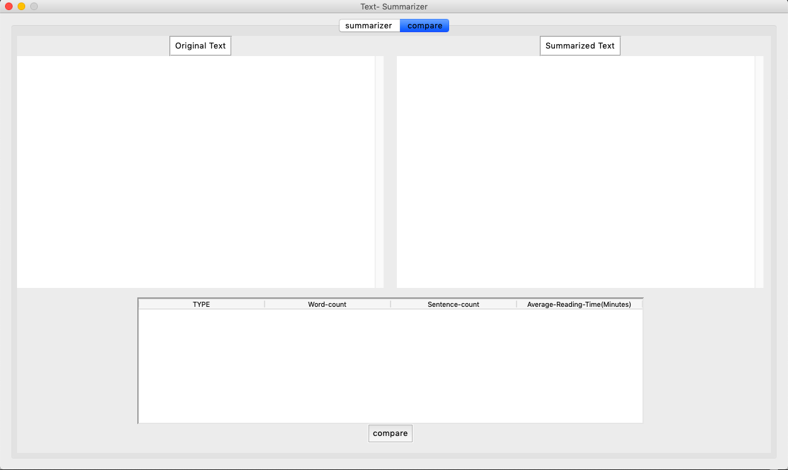
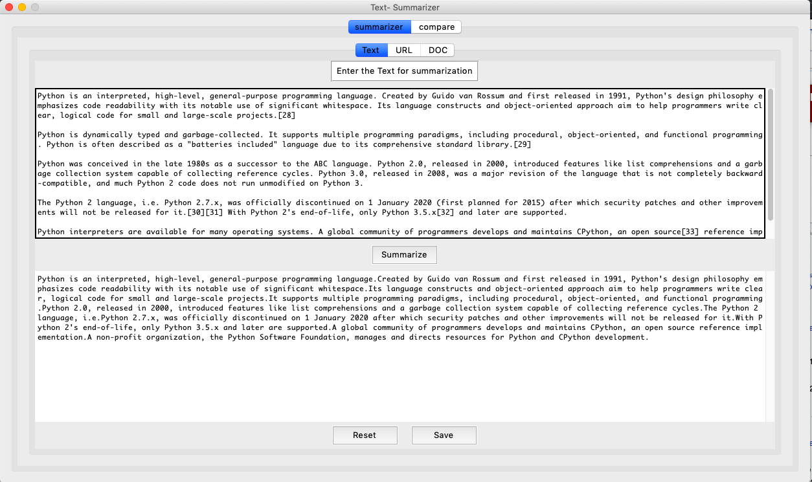
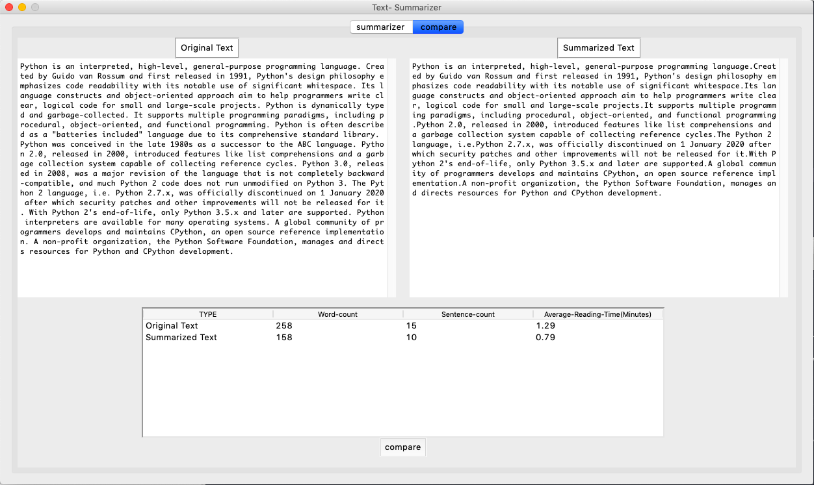

# Text-Summarization
Summarizing the given text using Abstractive Text Summarization techniques.

## Description
The main aim of this project is to reduce the original content of text into the most relevant and siginifcant matter.
Text can be provided in three ways, direct text, URL feed and File format(.txt). Most relevant matter is extracted by determining the sentence frequency and word fequency.

## Packages used
- nltk
- re
- urllib
- bs4
- tkinter

## Work Flow and Package Usage
Created 2 python files. One file named as summarizer.py for core fucntionality i.e., summarization and the other file gui.py, 
which handles the user-interface part of the project. 
- **nltk** is used for language processing i.e., for word-tokenization and sentence-tokenization. From nltk. data module 
we use functions that can be used to load NLTK resource files, such as corpora and grammars.
- **re** package is used for text preprocessing. Using this we define regular expression by which we remove punctuations or 
any other unwanted content.
- **urllib** is used for web scrapping. we can access a particular url and retrieve content form them using this package.
- **bs4** is library which used for extracting content from html or xml files by iterating, searching the parse tree.
- **tkinter** is used for GUI. Using tkinter we can make windows, tabs, text fields, buttons and attach action_events to those 
buttons.

## Screenshots

